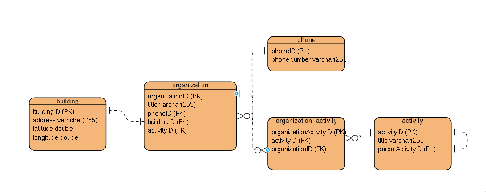

# 🌙 MMK Moon

[](https://laravel.com)
[](https://php.net)
[](https://docker.com)
[](https://postgresql.org)
[](https://redis.io)

Современное веб-приложение на Laravel с API для управления зданиями, организациями и активностями. Проект развернут в Docker с использованием Nginx, PHP-FPM, PostgreSQL и Redis.

## 📋 Содержание

- [🚀 Быстрый старт](#-быстрый-старт)
- [🏗️ Архитектура](#️-архитектура)
- [🔧 Технологии](#-технологии)
- [📁 Структура проекта](#-структура-проекта)
- [🔌 API Endpoints](#-api-endpoints)
- [🐳 Docker команды](#-docker-команды)
- [🛠️ Разработка](#️-разработка)
- [📊 База данных](#-база-данных)
- [🧪 Тестирование](#-тестирование)
- [📝 Лицензия](#-лицензия)

## 🚀 Быстрый старт

### Предварительные требования

- [Docker](https://docs.docker.com/get-docker/) (версия 28+)
- [Docker Compose](https://docs.docker.com/compose/install/) (версия 2+)
- [Make](https://www.gnu.org/software/make/) (опционально, для удобства)

### Установка и запуск

1. **Клонируйте репозиторий:**
   ```bash
   git clone <repository-url>
   cd mmk_moon
   ```

2. **Запустите проект:**
   ```bash
   # Полная настройка (рекомендуется для первого запуска)
   make setup
   
   # Или пошагово:
   make build    # Собрать образы
   make up       # Запустить сервисы
   make install  # Установить зависимости
   make migrate  # Запустить миграции
   make seed     # Заполнить тестовыми данными
   ```

3. **Откройте в браузере:**
   - 🌐 **Веб-приложение:** http://localhost
   - 🗄️ **Adminer (БД):** http://localhost:8080
   - 📚 **API документация:** http://localhost/api/documentation

## 🏗️ Архитектура

```
┌─────────────────┐    ┌─────────────────┐    ┌─────────────────┐
│   Nginx (80)    │    │   PHP-FPM       │    │   PostgreSQL    │
│   (Frontend)    │◄──►│   (Laravel)     │◄──►│   (Database)    │
└─────────────────┘    └─────────────────┘    └─────────────────┘
                                │
                                ▼
                       ┌─────────────────┐
                       │   Redis         │
                       │   (Cache/Queue) │
                       └─────────────────┘
```

## 🔧 Технологии

### Backend
- **Laravel 12.x** - PHP фреймворк
- **PHP 8.4+** - Язык программирования
- **PostgreSQL 17+** - Основная база данных
- **Redis 8+** - Кэширование и очереди

### Frontend & Infrastructure
- **Nginx** - Веб-сервер
- **Docker & Docker Compose** - Контейнеризация
- **Adminer** - Веб-интерфейс для БД

### Development Tools
- **L5-Swagger** - API документация
- **Laravel Sanctum** - API аутентификация
- **PHPUnit** - Тестирование

## 📁 Структура проекта

```
mmk_moon/
├── 📁 etc/                    # Docker конфигурации
│   ├── 📁 httpd/             # Apache конфигурация
│   ├── 📁 nginx/             # Nginx конфигурация
│   ├── 📁 php/               # PHP конфигурация
│   ├── 📁 postgresql/        # PostgreSQL конфигурация
│   └── 📁 redis/             # Redis конфигурация
├── 📁 www/                   # Laravel приложение
│   ├── 📁 app/
│   │   ├── 📁 Http/Controllers/  # Контроллеры
│   │   ├── 📁 Models/            # Модели
│   │   └── 📁 Repository/        # Репозитории
│   ├── 📁 database/
│   │   ├── 📁 migrations/        # Миграции БД
│   │   ├── 📁 seeders/           # Сидеры
│   │   └── 📁 factories/         # Фабрики
│   └── 📁 routes/                # Маршруты
├── 🐳 docker-compose.yml     # Docker Compose
├── 📋 Makefile               # Команды для разработки
└── 📖 README.md              # Документация
```

## 🔌 API Endpoints

### Аутентификация
Все API запросы требуют токен в заголовке:
```
Token: base64:A2l+2Z5HYTLmVzbxuZBAYd4WU3VgCjnFqGEjASiBsUs=
```

Токен можно найти в .env файле в APP_KEY

### Доступные endpoints:

#### 🏢 Здания (Buildings)
```bash
# Получить список зданий
GET/POST http://localhost/api/v1/building
```

#### 🎯 Активности (Activities)
```bash
# Получить список активностей
GET/POST http://localhost/api/v1/activity
```

#### 🏢 Организации (Organizations)
```bash
# Получить организации по ID
GET http://localhost/api/v1/{id}/organization

# Поиск организаций
POST http://localhost/api/v1/search
```

### Пример использования

```bash
# Поиск активности "Ferry"
curl --location 'http://localhost/api/v1/search' \
--header 'Token: base64:A2l+2Z5HYTLmVzbxuZBAYd4WU3VgCjnFqGEjASiBsUs=' \
--form 'activity="Ferry"'
```

## 🐳 Docker команды

### Основные команды
```bash
make help          # Показать все команды
make up            # Запустить сервисы
make down          # Остановить сервисы
make restart       # Перезапустить сервисы
make logs          # Показать логи
make logs-f        # Логи в реальном времени
```

### Разработка
```bash
make shell         # Войти в PHP контейнер
make db-shell      # Войти в PostgreSQL
make artisan cmd='migrate'  # Выполнить artisan команду
make cache-clear   # Очистить кэш Laravel
```

### База данных
```bash
make migrate       # Запустить миграции
make seed          # Заполнить тестовыми данными
make migrate-rollback  # Откатить миграции
```

### Очистка
```bash
make clean         # Полная очистка (контейнеры, сети, тома)
```

## 🛠️ Разработка

### Локальная разработка

1. **Войдите в PHP контейнер:**
   ```bash
   make shell
   ```

2. **Установите зависимости:**
   ```bash
   composer install
   ```

3. **Настройте окружение:**
   ```bash
   cp .env.example .env
   php artisan key:generate
   ```

4. **Запустите миграции:**
   ```bash
   php artisan migrate
   php artisan db:seed
   ```

### Структура кода

- **Controllers** - Обработка HTTP запросов
- **Models** - Eloquent модели для работы с БД
- **Repository** - Паттерн Repository для работы с данными
- **Middleware** - Промежуточное ПО для валидации токенов

## 📊 База данных

### Основные таблицы:
- `users` - Пользователи системы
- `buildings` - Здания
- `organizations` - Организации
- `activities` - Активности
- `phones` - Телефонные номера
- `organization_activity` - Связь организаций и активностей



### Подключение к БД:
- **Host:** localhost
- **Port:** 5432
- **Database:** postgres
- **Username:** postgres
- **Password:** (см. etc/postgresql/.env)

## 🧪 Тестирование

```bash
# Запустить все тесты
make test

# Запустить тесты в PHP контейнере
docker-compose exec php php artisan test
```
